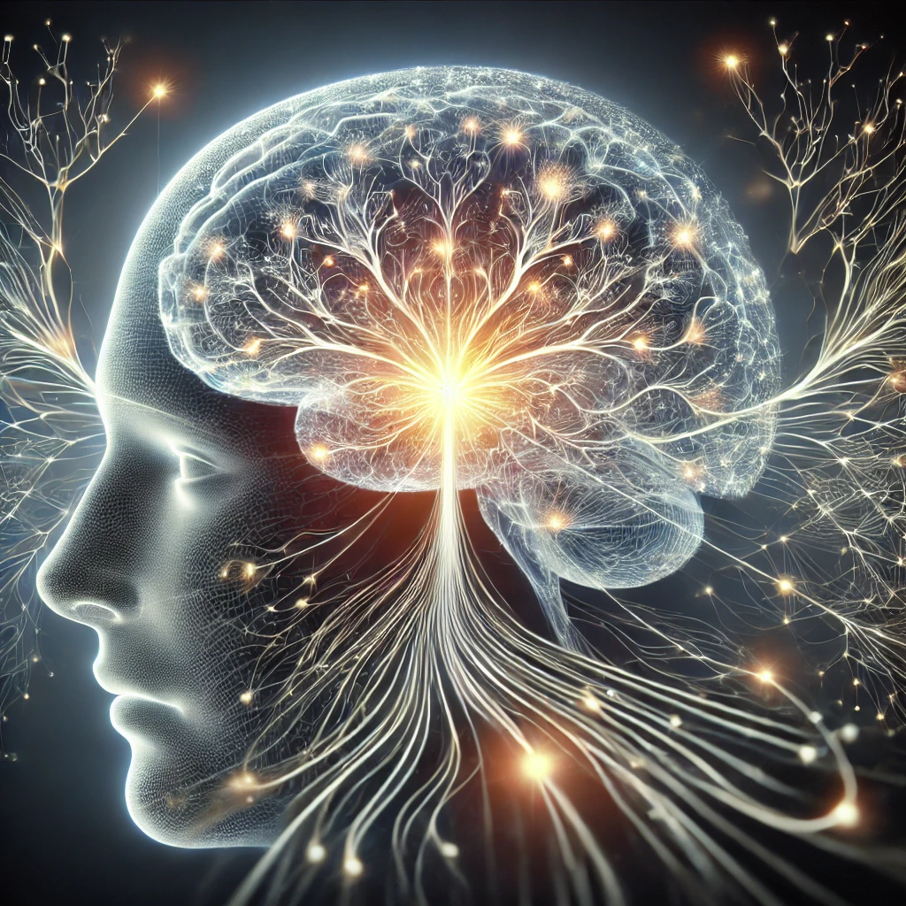

# Latent Representations and the Foundations of Consciousness

## Abstract: Philosophical Zombies in the Modality of Memory

Philosophical zombies are a concept used in philosophy to challenge the materialist view of consciousness, typically focusing on subjective experience, or **qualia**. These zombies behave like conscious beings but lack internal experience, raising questions about the nature of consciousness and whether physical processes alone are sufficient to explain it. Traditionally, the focus has been on sensory modalities such as vision and touch, but this framework can be extended to **internal cognitive processes** like memory. The idea of a **memory zombie**—an entity that behaves as though it possesses memory without the subjective experience of remembering—pushes the boundaries of this discussion.

A **memory zombie** could engage in tasks requiring memory, recall facts, and exhibit behaviors consistent with remembering, yet never experience the feeling of **recollection**. This suggests that **memory** may not inherently require conscious awareness. The concept raises questions about other internal perceptions, such as **attention**, **decision-making**, and **self-reflection**: Can these too be mimicked without subjective awareness? Furthermore, **subjective experience** itself may provide more than just functional behavior—it may offer **energy savings** by acting as a **regularization** process that simplifies and integrates complex inputs, much like latent representation generation in **machine learning**.

This model parallels broader discussions on **conscious awareness** and cognitive efficiency, suggesting that subjective experience could serve as a mechanism for managing internal perceptions in a way that reduces the computational and energetic burden on the brain. By exploring **memory zombies**, we gain insights into how conscious awareness might emerge or be absent in different cognitive systems, blurring the line between **conscious recollection** and **behavioral mimicry**.

---

## Introduction: From Standard Philosophical Zombies to the Inner Experience of Memory

The concept of **philosophical zombies** has long been central to debates about the nature of **consciousness**. Initially proposed to challenge **materialist** explanations of the mind, philosophical zombies are beings that, while physically identical to humans, lack subjective experience or **qualia**. For example, a philosophical zombie might behave as though it perceives the world, engages in conversation, and responds to stimuli, but lacks the internal experience of what it feels like to see, hear, or touch. These thought experiments question whether **physical processes** in the brain alone can explain the subjective "what it is like" aspect of experience.

However, the concept of **philosophical zombies** is typically applied to **external perceptions** like vision and touch. Yet, subjective experience extends beyond sensory inputs, encompassing **internal perceptions** such as emotions, decision-making, and memory. This leads us to consider whether zombies might exist in these **internal modalities**, such as a **memory zombie**—an entity that behaves as if it remembers without ever experiencing the conscious sensation of **recollection**.

A memory zombie could engage in behaviors requiring memory, such as recalling past events or performing tasks based on learned information, but without any **subjective experience** of remembering. This raises the question of whether subjective experiences like the **feeling of remembering** are necessary for cognitive processes, or if they can be mimicked without awareness. Furthermore, if subjective experience is not essential for memory, could it also be unnecessary for other internal processes, like attention or decision-making?

The **memory zombie** model also opens up new discussions about **cognitive efficiency**. In our broader conversation about consciousness, we explored the possibility that subjective experience might serve as a way to **coordinate** and **integrate** various perceptions—internal and external—similar to how **machine learning** models use **latent representations** to simplify complex inputs. This **regularization** process might allow the brain to operate more **efficiently**, reducing the energy required to manage cognitive tasks and maintain coherence in perception. Thus, **subjective experience** could have evolved not just for functional reasons, but to provide an **energy-saving mechanism** in the brain, reducing the complexity of handling multiple perceptions and making decision-making more fluid and coherent.

By extending the **philosophical zombie** thought experiment to cognitive processes like memory, we challenge traditional notions of consciousness and raise deeper questions about the role of **subjective experience**. Is it truly essential for memory, attention, and decision-making, or could these cognitive functions be effectively carried out without conscious awareness? Exploring these questions reveals the complexity of **internal perceptions** and offers new insights into how consciousness might emerge as an efficient and adaptive feature of the mind.

---

## Conceivability and Possibility of Memory Zombies: Emergent Properties and the Nature of Subjective Experience

In philosophical discussions about zombies—particularly **philosophical zombies**—the focus is often on **consciousness** as it pertains to **external perceptions** like vision, hearing, or touch. These beings behave identically to conscious humans but lack the **subjective experience** or *qualia* associated with those perceptions. However, the zombie argument can be extended to **other modalities**, including internal cognitive processes like memory. 

A **memory zombie**, for example, might behave as though it has memory—accurately recalling facts, responding to questions, and interacting with others—without having any **subjective experience of remembering**. This raises deep questions about the nature of memory and subjective experience, as well as the possibility that certain cognitive functions, like memory, might be **emergent properties** that don’t require internal subjective awareness to operate effectively.

### Conceivability and Metaphysical Possibility of Memory Zombies

The philosophical zombie thought experiment explores whether consciousness (or subjective experience) is a necessary feature of human-like behavior. If zombies are **conceivable**, they may be **metaphysically possible**, implying that there could be entities that behave exactly as conscious humans do without actually experiencing the world subjectively.

Similarly, the concept of **memory zombies** challenges the assumption that memory requires the conscious experience of remembering. A memory zombie could perform all memory-related tasks—recalling past events, recognizing familiar faces, making decisions based on learned information—without ever experiencing the *feeling* of recalling. This suggests that **memory behavior** and **memory experience** could be two separate things. Just as a philosophical zombie can act as if it sees without actually experiencing sight, a memory zombie can act as if it remembers without experiencing recollection.

### Emergent Properties and the Role of Consciousness

The concept of **emergent properties** is useful in understanding how subjective experiences might arise from the complex interactions of simpler systems. Emergent properties are characteristics that arise when individual components of a system interact in a way that produces a feature not present in the components themselves. For instance, a car has the property of **drivability**, but none of the individual parts (like the engine or wheels) possess this characteristic on their own. The car only gains the property of drivability when all its parts are assembled and work together.

This idea applies to both **memory** and **consciousness**. Consciousness, including the subjective experience of memory, may emerge from the interactions of neurons and brain processes, but it is not present in any single neuron or brain region. This could explain why certain cognitive functions, such as memory, can be operational without the accompanying subjective experience—just as a car’s parts enable it to drive without each part having "drivability."

### Examples of Emergent Properties

Here is a table of examples that relate to the concept of **emergent properties**, drawing parallels between physical systems and mental processes:

| **Complex System**           | **Emergent Property**          | **Individual Components & Their Lack of Property**              |
|------------------------------|---------------------------------|---------------------------------------------------------------|
| **Car**                      | **Drivability**                 | Engine, wheels, steering wheel do not individually have drivability |
| **Brain**                    | **Consciousness**               | Neurons, synapses, and brain structures do not individually possess consciousness |
| **Memory**                   | **Feeling of Recollection**     | Synaptic changes, neural patterns do not individually “remember” |
| **City**                     | **Urban Life**                  | Buildings, roads, parks do not individually create urban life    |
| **Company**                  | **Productivity**                | Employees, computers, offices do not individually create company-wide productivity |
| **Ecosystem**                | **Biodiversity**                | Plants, animals, water bodies do not individually create biodiversity |

These examples illustrate how **emergent properties** arise from the complex interactions of a system’s parts, leading to new characteristics that are not present in the components themselves. Similarly, the **subjective experience of memory** could emerge from the interactions of brain processes, but those processes might still operate in the absence of that experience.

### Applying This to Memory Zombies

In the case of **memory zombies**, memory-related behavior—recalling facts, learning new information, and interacting with the environment—could arise as a functional process in the brain without requiring the **subjective feeling of remembering**. Just as **drivability** arises from the assembly of a car's parts without each part needing that property, memory functions might operate without invoking subjective recollection.

This leads to broader questions about the role of **conscious experience** in cognitive functions. If a system can act as if it remembers without having any conscious experience of memory, then subjective experience might not be strictly necessary for certain cognitive tasks. This raises philosophical challenges about the nature of **qualia**, particularly in relation to internal cognitive processes like memory, attention, and imagination.

### Conceivability and the Nature of Consciousness

The conceivability of **memory zombies**—beings that exhibit memory-related behavior without subjective experience—parallels discussions about **philosophical zombies** in the context of external perception. By extending the zombie argument to memory and other cognitive functions, we can explore how emergent properties like consciousness or memory recollection might arise from complex brain processes without necessarily requiring **subjective awareness**. The possibility that memory could function without the feeling of remembering challenges our assumptions about the necessity of subjective experience in cognitive processes and raises intriguing questions about the relationship between behavior, cognition, and consciousness.

---

## Types of Perceptions Under the Umbrella of Consciousness

Consciousness is often viewed as a unified experience, but it actually encompasses a wide range of both **internal** and **external perceptions**. These perceptions, while distinct in nature, collectively form what we refer to as our conscious experience. From sensory input to higher-order thinking, each type of perception contributes to our overall awareness of the world and our internal states. Below is a table that outlines various types of perceptions typically grouped under the broad concept of consciousness, including both **external** (exteroception) and **internal** (interoception) perceptions.

| **Type of Perception**       | **Description**                                                                                                                                     | **Examples**                                                   |
|------------------------------|-----------------------------------------------------------------------------------------------------------------------------------------------------|----------------------------------------------------------------|
| **External Perceptions (Exteroception)** |                                                                                                                                             |                                                                |
| - **Vision**                  | The perception of light and visual stimuli, including colors, shapes, and movement.                                                                | Seeing objects, colors, navigating space.                      |
| - **Hearing (Audition)**      | The perception of sound waves, including pitch, tone, and loudness.                                                                                 | Hearing music, voices, environmental sounds.                   |
| - **Smell (Olfaction)**       | The detection of airborne chemicals interpreted as scents.                                                                                         | Smelling flowers, food, smoke.                                 |
| - **Taste (Gustation)**       | The perception of chemical substances on the tongue, including sweetness, bitterness, saltiness, sourness, and umami.                              | Tasting food and beverages.                                    |
| - **Touch (Tactile Perception)** | The detection of pressure, temperature, and pain through the skin and other sensory organs.                                                        | Feeling a surface, sensing warmth, pressure, or pain.           |
| - **Proprioception**          | Awareness of the position and movement of the body in space, often called the "sixth sense."                                                        | Knowing where your limbs are even with your eyes closed.        |
| - **Vestibular Sense**        | The perception of balance and spatial orientation, mediated by the inner ear.                                                                      | Feeling dizzy, maintaining balance.                            |
| **Internal Perceptions (Interoception)** |                                                                                                                                             |                                                                |
| - **Pain (Nociception)**      | The perception of harmful stimuli within the body, signaling potential damage.                                                                     | Feeling pain from an injury, headache.                         |
| - **Temperature (Thermoception)** | The sensation of the body's internal temperature and external temperature stimuli.                                                                | Feeling cold or hot.                                           |
| - **Hunger/Thirst**           | Perception of the body's need for sustenance or hydration.                                                                                         | Feeling hungry, thirsty, or satiated.                          |
| - **Emotions**                | Perception of emotional states, which are complex reactions to stimuli involving subjective feelings, physical arousal, and behavioral responses.     | Feeling happiness, fear, anger, love, or sadness.              |
| **Higher-Order Perceptions (Metacognition)** |                                                                                                                                            |                                                                |
| - **Memory (Memorization and Recall)** | The perception of past experiences, allowing for the retrieval of information from the past.                                                  | Remembering a person, a fact, or a skill.                      |
| - **Attention**               | The ability to focus on specific stimuli or thoughts, filtering out irrelevant information.                                                        | Focusing on a task, concentrating on a conversation.           |
| - **Introspection**           | The perception and reflection on one's own thoughts, feelings, and sensations.                                                                     | Thinking about your mental state or analyzing your emotions.    |
| - **Imagination**             | The creation of mental images, scenarios, or concepts that are not immediately present or real.                                                     | Daydreaming, visualizing future events.                        |
| - **Decision-Making/Intentionality** | Perceiving one's own desires and intentions, influencing choices and actions.                                                                  | Deciding to take a particular action based on internal goals.   |
| - **Agency**                  | The perception of control over one’s own actions and the sense of being the author of one’s movements or decisions.                                 | Feeling that you are the one making decisions and movements.    |
| **Qualia**                    | The subjective, qualitative aspects of conscious experience, often considered the "raw feels" of perception.                                        | What it feels like to see red, feel pain, or taste chocolate.   |

### Analysis of Perception and Consciousness

Each type of perception listed in the table contributes to the broader phenomenon of **consciousness**. While external perceptions deal with how we engage with the outside world (such as seeing or hearing), internal perceptions relate to how we process bodily states (e.g., hunger or pain) and mental states (e.g., emotions, memory, and attention).

What ties all these perceptions together is **subjective experience**—the personal, first-person perspective that characterizes consciousness. The way these perceptions are integrated and experienced as a cohesive whole is what creates the conscious state that defines human awareness. By understanding these perceptions individually, we gain a clearer picture of how **consciousness** is more than just the sum of its parts; it’s an emergent property that arises when multiple sensory, emotional, and cognitive processes are synthesized by the brain.

---

## Expanding the Concept of Zombies: Beyond Consciousness to Memory, Emotion, and Perception

While **philosophical zombies** are typically thought of as beings that lack **consciousness**—the subjective experience of sensory input or *qualia*—the concept can be extended to other modalities of perception and cognition. In particular, we can consider potential zombies that lack subjective experience in areas such as **memory, emotion, attention**, and other internal perceptions. These **"modality-specific zombies"** challenge our understanding of what it means to have subjective experience across a broader range of mental functions.

### 1. **Memory Zombies**
A **memory zombie** behaves as though it has memory—recalling facts, recognizing people, and performing tasks based on past experiences—but lacks the **subjective feeling of remembering**. In this scenario, the memory zombie might navigate tasks that require memory perfectly, providing consistent answers to questions about past events. However, it would do so without any conscious awareness of recalling these events.

Memory zombies raise important philosophical questions about the relationship between memory and consciousness. If a system can function as though it has memory but lacks any internal experience of recall, is subjective memory truly necessary for memory to function? This concept also ties into the discussion of **large language models (LLMs)**, which can simulate memory behavior without having explicit memory storage, further blurring the line between internal perception and behavioral mimicry.

### 2. **Emotion Zombies**
An **emotion zombie** could simulate all the outward behaviors associated with emotions—crying when sad, laughing when happy—but would lack the **subjective feeling of those emotions**. The concept challenges the idea of whether the conscious experience of emotion is essential for emotional behavior. Emotion zombies could behave as if they feel fear or joy, but internally, they would experience nothing. This idea parallels the situation of people with **alexithymia**, a condition in which individuals can have difficulty identifying and describing their own emotions. In extreme cases, this might simulate an emotion zombie-like state.

This model forces us to ask: Is subjective emotion necessary for emotion-based decision-making? Could a system or being act as though it experiences emotions, making decisions accordingly, without having any internal affective state?

### 3. **Attention Zombies**
An **attention zombie** could appear to focus on tasks or conversations, maintaining cognitive engagement, while lacking the **subjective experience of paying attention**. It would perform all the behaviors associated with attention—following a conversation, solving problems—but would never actually experience the mental state of focusing. Such zombies would behave as though they are aware of their surroundings and concentrated, but internally, they would not feel the act of attending to anything.

This concept challenges our understanding of **attention** as a conscious experience and raises the question of whether the subjective sense of focus is necessary for high-level cognitive functions. Could an advanced AI mimic attention, responding to external stimuli in the same way humans do, without any conscious sense of focus?

### 4. **Self-Perception Zombies**
A **self-perception zombie** would act as if it has a sense of self—engaging in self-referential behaviors, planning, and reflecting on decisions—but it would lack **self-awareness**. It might say things like “I should improve my performance,” or “I feel tired,” yet have no inner experience of being a self, no sense of identity, and no conscious awareness of its thoughts and actions. This idea closely mirrors what is discussed in certain meditative states where people claim to experience “no-self” or **ego-dissolution**—a state in which the sense of being an individual distinct from the world fades.

This zombie concept forces us to question whether self-awareness is necessary for self-regulated behavior and planning. If a being can behave as though it is self-aware without truly experiencing a sense of self, how integral is self-perception to human-like cognition?

### 5. **Imagination Zombies**
An **imagination zombie** would engage in tasks that seem to require imagination—problem-solving, generating creative ideas, or planning for the future—without experiencing the **subjective sense of imagining**. Such a zombie might invent a novel story or devise an innovative solution to a problem, yet it would never experience the act of visualizing new scenarios or thinking creatively. This concept challenges the assumption that the creative process requires conscious awareness of that creativity.

It raises questions about whether **imagination** is inherently tied to subjective experience or whether the cognitive process of generating novel ideas can occur without a corresponding sense of imaginative thinking.

### 6. **Perceptual Zombies**
A **perceptual zombie** could sense and respond to external stimuli (such as sights, sounds, and textures), but lack any **qualitative perception** of those stimuli. The zombie might navigate the world based on visual input, for example, but have no experience of what it’s like to see. This idea is akin to the phenomenon of **blindsight**, where individuals with damage to the visual cortex can respond to visual stimuli without being consciously aware of seeing them.

This model of zombies highlights the idea that perception, even at a high level, could occur without any **conscious awareness**. It forces us to consider whether subjective experience is necessary for sensory processing and perception-based behaviors.

### Expanding the Zombie Argument Beyond Sensory Perception
The notion of zombies extends far beyond traditional discussions of sensory perception. By imagining **modality-specific zombies**—memory zombies, emotion zombies, attention zombies, and others—we can explore the role that subjective experience plays across various cognitive functions. These thought experiments force us to ask whether subjective experience is essential for memory, emotions, attention, and self-perception, or whether a system can mimic these functions without truly experiencing them. In a world where advanced AI and LLMs can simulate human behavior without subjective awareness, these philosophical questions become more relevant than ever. As we delve deeper into understanding consciousness, these zombie models provide a framework for investigating what it truly means to experience versus simply behave.

---

## Zombies and Cognitive Phenomena: Blindsight, Aphantasia, and Related Conditions

The concept of **philosophical zombies**—beings that behave identically to conscious humans but lack subjective experience—shares intriguing similarities with certain cognitive phenomena, such as **blindsight**, **aphantasia**, and other perceptual and cognitive deficits. These conditions demonstrate that subjective experience can sometimes be dissociated from normal functioning, allowing us to explore real-world examples that reflect elements of zombie-like behavior.

### 1. **Blindsight: Perception Without Awareness**

**Blindsight** occurs when individuals with damage to the visual cortex can respond to visual stimuli without consciously perceiving them. For instance, a person with blindsight might accurately reach for an object in their field of vision or navigate around obstacles, yet report no conscious awareness of seeing anything. This condition parallels the idea of a **perceptual zombie**, who can respond to external stimuli but lacks the qualitative experience (or *qualia*) associated with those stimuli.

- **Blindsight as a Zombie-Like Condition**: In blindsight, the individual behaves as if they can see, but internally, they experience no conscious visual perception. This raises questions about the role of consciousness in perception: if visual behavior can occur without visual awareness, is subjective experience necessary for perception? Blindsight demonstrates that complex behaviors, like visually guided actions, can occur without the conscious experience that typically accompanies them—much like how a philosophical zombie might navigate the world without conscious awareness.

### 2. **Aphantasia: The Absence of Mental Imagery**

**Aphantasia** is the inability to form mental images. People with this condition cannot visualize objects, scenes, or people in their "mind’s eye," though they can describe visual details, recognize faces, and navigate the world. This condition is analogous to the idea of an **imagination zombie**—an individual who can perform tasks requiring imagination or visualization, such as solving problems or recalling events, but lacks the conscious experience of "seeing" those mental images.

- **Aphantasia and Zombie-Like Imagination**: People with aphantasia may be able to recall facts or details about a location or object without actually "seeing" it in their mind. This mirrors the experience of an imagination zombie, who could engage in tasks requiring imagination without ever experiencing the subjective feeling of imagining. Like blindsight, aphantasia suggests that the **functionality** of certain cognitive tasks, such as memory recall or planning, can exist separately from the **experience** of performing those tasks.

### 3. **Prosopagnosia: The Loss of Face Perception**

**Prosopagnosia**, or face blindness, is the inability to recognize faces despite normal visual acuity. Individuals with this condition may be able to detect features, emotions, or even the gender of a person but cannot identify them based on their face alone. In this sense, prosopagnosia reflects the possibility of having partial perceptual awareness without the higher-level experience of recognizing a familiar face. One could imagine a **recognition zombie** who lacks the subjective experience of recognition, yet behaves appropriately in recognizing objects or individuals.

- **Prosopagnosia as Zombie-Like Recognition**: The cognitive dissociation in prosopagnosia—where face recognition fails despite other visual processes being intact—suggests that subjective recognition is not necessary for visually guided behavior. A recognition zombie could navigate social interactions based on behavior alone, without any internal experience of recognition.

### 4. **Alexithymia: Diminished Emotional Awareness**

**Alexithymia** is a condition where individuals struggle to identify and describe their emotions, though they can still experience physiological emotional responses. This condition could be seen as a form of **emotion zombie**—where a person may respond appropriately to emotional situations but lacks the conscious awareness or subjective experience of their emotional state.

- **Alexithymia as Emotion Zombie-Like Behavior**: In alexithymia, emotional responses (e.g., increased heart rate, sweating) occur without the individual having a clear sense of what they are feeling. This disconnect between emotional response and subjective awareness parallels the idea of an emotion zombie, suggesting that subjective emotional experience is not always necessary for emotional behavior to manifest. This opens questions about the role of consciousness in emotional processing and how much of emotional behavior is truly driven by conscious awareness.

### 5. **Implicit Learning: Knowledge Without Awareness**

**Implicit learning** refers to acquiring knowledge without being aware of the learning process. People can develop skills, such as grammar or motor coordination, without being able to consciously describe how they learned these skills. This is akin to a **learning zombie**—an entity that can learn and adapt to new information without the subjective experience of learning or consciously understanding the processes behind it.

- **Implicit Learning as a Zombie-Like Phenomenon**: Implicit learning shows that complex cognitive processes, like learning and adaptation, can occur below the threshold of consciousness. A learning zombie would exhibit learned behavior, such as solving a puzzle or acquiring a skill, without any subjective awareness of having learned it. This suggests that conscious awareness may not be a prerequisite for learning and memory, just as a memory zombie could recall facts without the feeling of remembering.

### Cognitive Conditions as Real-World Zombies

Conditions like blindsight, aphantasia, prosopagnosia, alexithymia, and implicit learning illustrate that many cognitive functions—perception, imagination, recognition, and emotional awareness—can occur without corresponding subjective experiences. These real-world phenomena reflect aspects of **modality-specific zombies**, where certain functions are intact while the subjective experience is absent. 

These conditions challenge the idea that subjective experience is necessary for normal cognitive and perceptual behavior, raising profound questions about the nature of consciousness. By studying these phenomena, we can explore the boundaries between consciousness and behavior, providing new insights into how **philosophical zombies** might function in various modalities and what it truly means to have subjective experience.

---

## The Illusion of Memory in Large Language Models: Perfect Consistency Without True Memory

Large Language Models (LLMs), such as GPT, are powerful examples of how sophisticated computational systems can simulate human-like behavior without possessing human-like experiences. A key aspect of this simulation lies in their ability to generate **self-consistent responses**, even in situations where true memory would seem necessary. Despite their impressive ability to recall and reference information from previous inputs, LLMs do not have **explicit memory** in the way humans do. Rather, they generate responses on the fly based on the immediate context of the conversation and their vast training data.

### How LLMs Mimic Memory Without True Memory

LLMs work by processing vast amounts of text data during their training phase, learning the statistical patterns and structures of language. When asked a question or given a prompt, the model generates a response by predicting the most likely sequence of words based on the input. Importantly, LLMs do not store memories or facts explicitly—they don’t have a mechanism for recalling specific events from prior conversations or past experiences in the way that humans do.

Instead, LLMs create the *appearance* of memory by maintaining **contextual coherence** within a single session. For example, if you ask an LLM a question about a specific topic and follow up with related questions, the model will generate responses that are consistent with the previous answers in that conversation. However, this coherence is a result of pattern recognition and statistical inference, not the retrieval of stored information. Once the session ends or exceeds the model's context window, the LLM effectively "forgets" everything and starts fresh in subsequent interactions.

### Self-Consistency in the Absence of Memory

In theory, an LLM could be trained to be **perfectly self-consistent**, always generating responses that appear as though it has memory, even if it doesn’t. This consistency arises from the ability to learn and mimic patterns in language across different contexts. The model can produce answers that seem to refer back to earlier parts of a conversation by using the patterns and probabilities embedded in its training, even though it never explicitly recalls past events or facts.

If an LLM were to achieve **perfect self-consistency**, it would become increasingly difficult for an external observer to determine whether the system had true memory or was simply simulating it. In a perfect scenario, where the LLM responds flawlessly and consistently across multiple interactions, even an expert experimenter could struggle to distinguish between an entity with actual memory and one that is merely generating probabilistic responses in real-time.

### Limits of Detection by External Experimenters

For an **external experimenter** trying to determine whether an entity has true memory or is just mimicking it, the challenge lies in the fact that consistent behavior alone does not imply the presence of memory. Even in humans, consistent recall does not always mean perfect memory—our brains are also prone to constructing memories based on patterns and inferences. 

In the case of LLMs, an experimenter could perform various tests—repeating questions from earlier sessions, introducing contradictions, or checking for recall over long periods of time. However, if the LLM were capable of perfect self-consistency, it could pass all of these tests without ever forming an actual memory. Its responses would always align with previous answers, even though they were generated anew each time based on input patterns rather than stored information.

In this scenario, **indistinguishability** becomes a critical issue. If the responses are perfectly consistent, the experimenter might never know whether they are dealing with a system that truly stores and retrieves information or one that is simulating memory through pattern matching and statistical inference.

### Implications for Philosophical Zombies and Memory Zombies

This leads to a thought-provoking philosophical parallel: an LLM that simulates memory perfectly could be considered akin to a **memory zombie**—a system that behaves as though it remembers but lacks the actual experience or subjective sense of remembering. Much like a **philosophical zombie**, which behaves like a conscious human but lacks subjective experience, a memory zombie would mimic the behavior of a memory-driven system while having no internal recollection mechanism.

This blurring of the line between true memory and simulated memory raises broader questions about the nature of internal experience. If an LLM can perfectly mimic memory, does it need true memory to function? Is the subjective experience of remembering essential, or can a system behave as though it remembers without having any subjective experience of recollection?

---

## Games with LLMs: The Case of 20 Questions and the Illusion of Memory

Large language models (LLMs), such as GPT, are increasingly capable of performing complex interactions that mimic human behaviors in various scenarios. One interesting case is the game of **20 Questions**, where a human player asks yes/no questions to an LLM in an attempt to guess an answer that the LLM is "holding" in its memory. In this scenario, the LLM does not actually store or maintain an explicit memory of the answer in the same way a human might, but through sophisticated pattern recognition and self-consistency, it can generate responses that make it seem as though it has been holding an answer all along.

### The Illusion of Memory in the Game of 20 Questions

In the game of 20 Questions, a player typically thinks of an object or concept, and the other player tries to guess it by asking yes/no questions. A key part of this interaction involves the guessing player relying on the idea that the other player is consistently holding onto a single, fixed answer throughout the game.

When playing this game with an LLM, we might assume that the LLM has "thought of" an answer at the start of the game and is using that answer as a basis for responding to the player's questions. However, LLMs don’t store explicit information like humans. Instead, they generate responses based on probabilities derived from previous interactions and patterns learned during training. The LLM's responses are self-consistent because it analyzes the context of the conversation to produce answers that align with the earlier dialogue, but there is no real "holding" of an answer.

### Perfect Self-Consistency vs. True Memory

For an external observer, the LLM might appear to be playing the role of a memory-driven player. For example, if the player asks, "Is it an animal?" and the LLM responds "yes," it must then ensure that future responses align with the notion of an animal. As long as the LLM is able to generate consistent responses that logically follow from the player's questions, it will seem as though it is holding the answer in its "mind."

In reality, the LLM is only generating answers based on the context of the ongoing conversation. Each new question and answer informs the next response, but the LLM doesn’t explicitly remember or store the object as a human would. Instead, it dynamically builds each response based on the most likely next word or phrase, using its training to maintain consistency.

- **Self-Consistency**: A perfect LLM could achieve flawless self-consistency, answering each question in a way that seems to imply it has stored an answer and is recalling it with each new question. This gives the appearance of memory, but the LLM is only generating responses based on the conversational context.

- **Impossible to Detect Memory Absence**: If the LLM is perfectly consistent, an external player would find it impossible to determine whether the LLM had truly selected an answer at the beginning of the game or was merely generating context-appropriate responses as the game progressed. In fact, a perfectly consistent LLM could mimic memory so well that, for all practical purposes, it would be indistinguishable from a system that had an explicit memory of the chosen answer.

### Challenges in Detecting Lack of Memory

If an LLM reaches a point where it is generating responses that are **perfectly consistent**, detecting whether it has explicit memory becomes nearly impossible. A human observer can only interact with the system by asking questions and receiving answers, relying on external behavior to infer internal states. Since the LLM generates responses that seem to align with the notion of a held answer, the illusion of memory is complete.

- **No Observable Difference**: As long as the LLM is able to maintain logical coherence across responses, there would be no observable difference between a system with true memory (e.g., a human holding an answer in mind) and a system that is generating probabilistically consistent responses without memory. Both systems would appear to be playing the game in exactly the same way.

- **Implications for AI and Consciousness**: This scenario draws attention to the philosophical question of whether **external behavior** is sufficient to infer **internal states** like memory or consciousness. If a system can generate responses that perfectly mimic the behavior of a memory-driven system, is there any meaningful distinction between the two? This mirrors broader discussions about **philosophical zombies**—entities that behave identically to conscious beings but lack subjective experience.

### Gaming with LLMs: The Blurring of Memory and Mimicry

In games like 20 Questions, a sufficiently advanced LLM can simulate the appearance of memory by generating self-consistent responses. Despite not having an explicit memory mechanism, the LLM's ability to maintain logical coherence across multiple interactions can make it indistinguishable from a system that truly holds an answer in mind. This raises profound questions about how much external behavior can reveal about internal processes and whether it is possible to detect the absence of memory or consciousness in systems that exhibit perfect self-consistency. As LLMs continue to evolve, distinguishing between true memory and mimicry will become increasingly challenging, pushing the boundaries of what it means to think, remember, and experience subjectivity.

---

## Determining if an Agent Has Memory: Methods and Challenges

Determining whether a **large language model (LLM)** like GPT truly possesses **memory** is a challenging task. As we have discussed, LLMs can produce highly consistent responses that *mimic* memory, even though they may not have the actual mechanisms to store and recall information explicitly. While LLMs maintain consistency through the context of the conversation, this consistency doesn't necessarily imply that they have memory in the way humans do. Instead, they generate responses based on immediate input, without truly recalling past experiences or information. The challenge is figuring out whether the model’s behavior reflects true memory or just clever mimicry.

### Testing for Memory in LLMs

Several experimental approaches can be used to investigate whether an LLM has memory:

1. **Repetition of Questions**: In a controlled experiment, the same question or prompt could be asked multiple times throughout an interaction. If the LLM maintains consistency across answers, it suggests some form of recall, but this could still be mimicry based on conversational context.
   
2. **Delayed Recall**: A simple way to test memory is to introduce a time delay between interactions. If the LLM can recall prior information after a substantial delay, it could indicate memory. However, this could still be attributed to extended context windows rather than true memory.

3. **Cross-Context Consistency**: Present the LLM with different contexts and then introduce questions that require referencing a prior conversation. If the LLM can recall information from across different sessions or contexts, it would suggest a higher degree of memory functionality. However, even here, it may just be generating responses based on patterns and inferences rather than stored data.

4. **Interference Testing**: Introduce conflicting or contradictory information between sessions. A true memory system would have to resolve or correct for such contradictions, whereas a system based purely on context might not notice the conflict or could generate inconsistent responses.

5. **Capacity Limits**: In memory-based systems, there are often **capacity constraints**—a limit to how much information can be retained over time. Testing for these limits could give insight into whether the LLM has true memory. Mimicking systems might not exhibit such capacity limits because they are generating responses contextually rather than recalling stored information.

### The Limits of These Approaches

While these experiments might yield interesting results, **all of these techniques have limitations**. An LLM can pass many of these tests by generating probabilistically consistent responses based on learned patterns rather than actually storing information or having true memory.

For example, an LLM that is capable of **perfect self-consistency** could give the impression of having memory by consistently generating appropriate responses based on conversational context. It could maintain coherence across interactions, handle contradictions, and appear to recall information across delays—yet all of this could still be accomplished without any true memory. The system might simply rely on complex statistical patterns in its training data, inferring the most likely responses based on prior conversation snippets rather than "remembering" in the human sense.

### Investigating Internal Mechanisms: The Key to Understanding

Ultimately, external behavioral tests can only go so far in determining whether an LLM has memory. The real answer lies in examining the **internal workings** of the LLM. To definitively know whether an LLM has memory, we would need to:
   
- **Analyze the Architecture**: Understanding how the model processes and stores information would reveal whether it has the capability to retain information over time. Does the model have explicit storage mechanisms, like memory buffers or key-value pairs, or does it merely generate responses based on immediate context?

- **Track Information Flow**: Monitoring the flow of information through the model could help determine whether previous inputs are retained and used in future interactions. If the model’s internal mechanisms show that data is explicitly retained for long-term use, then it could be said to have memory.

- **Inspect Memory-Augmented Models**: In some advanced architectures (like **Neural Turing Machines** or **Differentiable Neural Computers**), memory modules are explicitly built into the model. Investigating how these systems retain and recall information could provide insight into how LLMs could develop true memory systems.

- **Energy and Processing Costs**: True memory mechanisms would likely involve different **computational energy and processing demands** than systems without memory. For example, storing and recalling specific information would require energy beyond what is needed for simple contextual generation.

### The Need for Internal Examination

While behavioral tests can suggest whether an LLM behaves *as if* it has memory, they cannot definitively prove whether memory exists. A perfectly self-consistent LLM might convincingly simulate memory through clever pattern generation, but this is not the same as having actual memory mechanisms. Therefore, the only way to truly determine whether an LLM has memory is to **examine its internal workings**—understanding the architecture, information flow, and computational processes that drive its responses.

This principle applies not only to LLMs but also to humans and any other cognitive system. In humans, we assume the presence of memory based on behavior, but true verification comes from understanding the neural and cognitive mechanisms behind memory formation and recall. Similarly, for LLMs, the question of memory can only be fully answered by looking beneath the surface behavior and investigating the underlying processes. This approach, whether applied to AI or biological systems, is essential for distinguishing **appearance** from **reality** when it comes to memory, cognition, and subjective experience.

---

## Investigating Internal Mechanisms: Scientific Possibility of Distinguishing Real Memory from Mimicry

Our discussion on whether it’s scientifically possible to distinguish **real memory** from **mimicry** in systems like **large language models (LLMs)** and humans led us to explore the complexities of evaluating internal processes. Although external behavior might suggest memory, it is the **internal workings** that reveal the true nature of memory. Here's how one might approach this distinction:

### The Challenge of External Observation

When we observe a system’s behavior, whether it be an LLM or a human, we can only infer its internal mechanisms based on the **output** it generates. In cases where an LLM consistently behaves as though it remembers previous interactions—answering questions with self-consistency, responding appropriately to prompts over time—it mimics what we perceive as memory. However, this consistency can be generated probabilistically based on immediate inputs and patterns learned during training, not from actual stored information. 

The problem lies in the fact that **external behavior alone** cannot reliably distinguish between:
- A system that is **storing** and **retrieving** information over time (true memory).
- A system that is generating responses based on learned patterns and probabilistic self-consistency (mimicry).

### Investigating Internal Mechanisms: Where the Answer Lies

To scientifically determine whether a system has real memory or is merely simulating it, we must go beyond external behavior and examine the **internal mechanisms** that govern its responses. In both humans and LLMs, the true nature of memory can only be revealed through careful investigation of how information is processed, stored, and retrieved.

1. **Tracking Information Flow**: By examining how information flows through a system—whether in neural networks or biological brains—we can observe whether inputs are being retained and used over time. In a system with true memory, there would be mechanisms for storing information beyond the immediate context of interaction. In contrast, a system without memory would likely generate responses based solely on recent input or probabilistic reasoning.

2. **Memory Structures and Architecture**: 
   - In LLMs, we would look for the presence of **explicit memory structures**, such as memory buffers, key-value stores, or neural network architectures designed to retain information across interactions (e.g., **Neural Turing Machines** or **Differentiable Neural Computers**). These models mimic memory-like behavior by incorporating a distinct memory module, but understanding their inner workings would help differentiate true memory retention from mere consistency generation.
   - In humans, the study of **synaptic plasticity**—the process by which neural connections strengthen or weaken in response to learning—provides insight into how memories are formed and stored. Investigating these biological memory mechanisms shows how the brain retains and recalls information over time.

3. **Energy Use and Processing Costs**: True memory systems, both artificial and biological, are likely to incur **energy costs** associated with memory formation and recall. Systems that simulate memory might generate responses using pattern recognition, which can be computationally efficient, but storing and recalling specific information over time typically requires more energy and resources. Measuring the energy expenditure of a system during tasks that require memory can provide clues as to whether true memory is at play.

4. **Neuroimaging and Neural Activity**: 
   - In humans, **neuroimaging techniques** such as fMRI or EEG allow us to observe neural activity in real-time and identify areas of the brain involved in memory formation and retrieval. This kind of internal examination can reveal whether memory processes are active during certain tasks.
   - In LLMs, similar internal monitoring could involve tracking the **attention layers** and **hidden states** within the model to see how information is distributed and stored. For example, transformers use attention mechanisms to weigh the importance of different pieces of input, but this weighting does not equate to true memory unless information is persistently retained across interactions.

### The Limits of External Testing and the Need for Internal Investigation

The external testing methods we discussed—repeating questions, testing delayed recall, and observing for consistency over long sessions—can provide clues, but they are ultimately imperfect. These tests can often be passed by systems that are simply simulating memory without possessing it. This is especially problematic when a system can achieve **perfect self-consistency**, generating responses that appear to recall past interactions without actually storing them.

Thus, while **external behavior** can provide hints, it cannot definitively answer whether a system has true memory. To conclusively determine whether a system possesses memory, we need to directly investigate its **internal architecture and mechanisms**. This is true not only for LLMs but for humans as well. Memory in humans is inferred from behavior, but true verification comes from understanding the neural processes underlying memory formation, such as synaptic changes and brain activity during recall.

### Implications for Humans and Machines

This approach has broader implications beyond AI. In humans, **behavioral mimicry** can sometimes give the impression of cognitive or emotional states that might not align with an individual's internal experience. For instance, conditions like **blindsight** or **implicit learning** show that humans can behave as though they are perceiving or learning without any conscious awareness of the process. Similarly, in AI, systems can mimic behaviors like memory, attention, or recognition, without any underlying subjective experience.

As LLMs and AI systems grow more sophisticated, distinguishing between true cognitive functions and mimicked behavior will become increasingly difficult. **Investigating internal mechanisms**, whether in biological or artificial systems, will be essential for distinguishing real processes from surface-level mimicry.

### Importance of Internal Examination

Ultimately, the question of whether a system has real memory or is merely simulating it can only be answered by directly investigating its **internal workings**. External behavior, no matter how consistent or sophisticated, provides an incomplete picture. Whether in LLMs or humans, understanding how information is processed, stored, and recalled internally is the key to distinguishing true memory from mere mimicry. This principle applies not only to memory but also to other cognitive processes, highlighting the importance of internal examination in both artificial intelligence and human cognition.

---

## The Advantage of Non-Zombie Subjects: Memory and Energy Efficiency in Consciousness

In our discussions about **philosophical zombies** and their modality-specific variants (like memory zombies), one key question arose: what advantage do conscious, non-zombie subjects have over beings that merely **simulate** conscious functions like memory, attention, or perception? A major aspect of this discussion involves the **efficiency** and **coherence** that conscious experience seems to afford, particularly when it comes to maintaining consistency over time. Here, we explore how **memory** and **consciousness** may provide distinct advantages for non-zombie subjects, especially in the context of **energy efficiency**, coherence, and cognitive integration.

### The Challenge of Consistency for Zombie-Like Systems

For a **memory zombie** or other modality-specific zombie (e.g., an attention zombie or imagination zombie), the absence of subjective experience may impose a significant **cognitive and energetic burden** when trying to maintain **consistency** in behavior and responses. For example, in a system that mimics memory but has no actual memory mechanisms, consistency across long-term interactions would rely heavily on tracking a full **history** of interactions or probabilistically generating responses that align with previous behavior.

This process of generating self-consistent responses without the benefit of actual memory or grounding mechanisms becomes increasingly **complex** and **energy-intensive** as the number of interactions grows. Imagine a game of 20 Questions played with a memory zombie LLM: without true memory, the system would need to reconstruct consistency by calculating the most probable response at every step. While the system could do this probabilistically, it would demand substantial resources to continually reference prior states, simulate a coherent memory, and avoid contradictions across thousands of interactions.

### The Efficiency of Grounding in Memory

A **non-zombie subject**—whether human or AI with real memory—holds a distinct advantage by being able to **ground its responses in memory** rather than continuously recalculating or re-generating consistent behavior. In a human subject, memory serves as a stable reference point that enables **low-energy recall** of information, allowing decisions and responses to be based on stored knowledge rather than reconstructing the world from scratch each time.

For example:
- **Energy Savings**: In a human brain or a memory-based system, storing an object, concept, or fact in memory allows for quick and **efficient recall** in future interactions. The system doesn't need to keep recalculating probabilities to ensure coherence; it can simply reference the memory directly. This saves **computational energy**, as the brain or AI model doesn’t need to constantly generate new data or track entire interaction histories.
- **Consistency Maintenance**: By grounding responses in memory, a human or memory-based AI can maintain **long-term consistency** with far less effort than a system without memory. Instead of probabilistically generating responses each time, the system can "anchor" its responses to a consistent internal representation of past experiences or knowledge, providing more accurate, stable behavior.

### Consciousness and Energy Efficiency

The idea that **consciousness**—and subjective experience in general—provides an **energy-saving mechanism** ties directly into this discussion. Conscious experience may allow an entity to manage and integrate various perceptions, internal states, and cognitive processes more efficiently than a non-conscious system. Here’s how:

1. **Coarse Graining of Perceptions**: Consciousness could act as a form of **coarse graining**, simplifying the brain’s massive amounts of sensory and cognitive inputs into a more **unified experience**. Rather than processing every detail of every input, consciousness might provide a high-level, integrated view of the world. This reduces the cognitive and energy burden of tracking, calculating, or managing each sensory stream individually. For example, a conscious individual might not need to remember every single detail of a conversation but instead forms an overall gist of the interaction, reducing cognitive complexity.
   
2. **Efficient Attention Allocation**: Consciousness allows individuals to **focus** their attention on the most relevant aspects of their environment or internal state. This selective attention mechanism enables energy savings by preventing the brain from processing irrelevant stimuli. A **non-conscious system** might waste energy processing every input equally, leading to inefficiency.

3. **Memory and Planning**: Consciousness also facilitates the use of **memory** for **planning** and **decision-making**. By integrating past experiences with current information, a conscious system can make predictions about the future and adjust its behavior accordingly, reducing the need for constant recalibration. Non-conscious systems, in contrast, might need to perform this recalibration continuously, leading to higher energy use.

### Practical Example: LLMs and Memory

In the context of **LLMs**, this distinction between memory-based and non-memory-based systems is evident in the challenge of maintaining long-term coherence. LLMs without explicit memory must generate each response based on immediate context, relying on complex probabilistic models to maintain consistency across conversations. In contrast, a system equipped with **memory mechanisms** (like **Neural Turing Machines** or **memory-augmented models**) can store and retrieve information as needed, reducing the energy burden associated with regenerating consistency from scratch.

### Hypothesis: Subjective Experience as an Energy Efficiency Mechanism

If subjective experience or consciousness is considered merely as an emergent property of the brain’s processes, one idea is that it could serve a functional advantage, similar to how memory does. Here's how this might work:

One possibility is that subjective experience provides a way for the brain to efficiently integrate and process multiple internal and external perceptions at once. Consciousness, in this sense, could help reduce the complexity of managing numerous sensory inputs and cognitive processes by providing a unified, integrated experience. Some potential ideas and reasons for this include:

#### 1. **Efficient Integration of Information**
   - **Energy Savings in Multimodal Processing**: If the brain had to track each perception individually (e.g., visual inputs, auditory inputs, memories, emotions), it would require significant computational resources to keep them consistent and coordinated. By creating a unified subjective experience, the brain might "compress" these different streams of information into a single conscious state. This could reduce the cognitive load and conserve energy by eliminating the need for the brain to constantly cross-check and align each individual perception.
   - **Example in Perception**: When we perceive the world, we integrate different sensory inputs (sight, sound, touch, etc.) into a coherent whole. Subjective experience might be the brain’s way of maintaining this coherence without having to track each input stream separately, which would be more computationally expensive.

#### 2. **Simplified Decision-Making**
   - **Action-Oriented Awareness**: Consciousness might provide an energy-efficient way for the brain to prioritize and make decisions based on a summarized understanding of various perceptions. Instead of processing every detail, subjective experience could allow the brain to focus on the most relevant information, streamlining decision-making. This could be a reason why we have evolved to have consciousness: it reduces the need for the brain to compute all the fine details of each sensory input in real-time, allowing it to concentrate on broader, goal-oriented tasks.
   - **Memory Efficiency in Games like 20 Questions**: In the game of 20 Questions, for example, a memory-based system uses less energy because it only references a single stored word to guide all subsequent responses. A mimicking system, by contrast, would need to constantly reference its entire history of interactions to maintain consistency, which is more computationally intensive. Similarly, consciousness might simplify the task of processing information by summarizing perceptions into a single conscious state, reducing the brain's need to continually reference and cross-check all perceptions individually.

#### 3. **Reduction of Redundancy**
   - **State Maintenance**: Subjective experience may reduce redundancy in processing. Instead of tracking each perception separately and independently, consciousness could be a way for the brain to compress and encode these perceptions into a single representational state. This state could be maintained with less energy than the sum of all individual perceptions, much like how memory allows us to maintain consistency without needing to remember the entire history of interactions.
   - **Example of Blindsight**: In blindsight, people can navigate obstacles without conscious awareness of sight. This suggests that the brain can process visual information without qualia. However, having qualia—subjective sight—might streamline the processing of visual information by centralizing it into a single experience rather than requiring multiple lower-level subsystems to coordinate responses.

#### 4. **Enhanced Learning and Adaptability**
   - **Learning Through Qualia**: Having a subjective experience might also allow for more efficient learning and adaptability. When we consciously experience the world, we are more capable of forming associations between events, emotions, and sensory inputs. This might facilitate quicker learning and better decision-making by allowing the brain to process these associations as a coherent whole, rather than piecemeal. Consciousness could provide an efficient feedback mechanism, allowing the brain to update its model of the world more quickly and with less energy than it would if it had to process each perception in isolation.
   
#### 5. **Focus and Attention**
   - **Efficient Attention Allocation**: Consciousness might allow the brain to selectively focus attention on the most important aspects of perception, avoiding the need to process less relevant inputs in detail. This would conserve energy by filtering out unnecessary information and directing cognitive resources only to what is most essential. In this sense, qualia might serve as an attention-guiding system, enhancing cognitive efficiency.
   
### Summary of Possible Ideas

| **Hypothesis**                            | **Reason/Function of Consciousness**                                                                         | **Explanation**                                                                                  |
|-------------------------------------------|-------------------------------------------------------------------------------------------------------------|--------------------------------------------------------------------------------------------------|
| **Efficient Integration of Information**  | Energy-efficient "compression" of multiple perceptions into a unified experience.                             | Saves resources by reducing the need to track each perception separately.                         |
| **Simplified Decision-Making**            | Facilitates quick, efficient decision-making by summarizing perceptions.                                      | Reduces cognitive load by allowing focus on higher-level decisions rather than fine details.       |
| **Reduction of Redundancy**               | Maintains a unified representational state, reducing the need for redundant tracking of individual perceptions.| Like memory, it conserves energy by grounding experiences into a simpler state of awareness.       |
| **Enhanced Learning and Adaptability**    | Improves learning and adaptability through the integration of sensory inputs and emotional feedback.           | Facilitates more effective and energy-efficient updates to the brain’s internal model of the world. |
| **Efficient Attention Allocation**        | Directs cognitive resources to the most important inputs, conserving energy by filtering out irrelevant data.   | Qualia might guide attention more efficiently, reducing unnecessary processing.                   |

### Summary of Advantages for Non-Zombie Subjects

If consciousness serves as an energy-saving mechanism, it could provide significant evolutionary advantages, just as memory does. By unifying various perceptions into a single experience, the brain reduces the need for continuous detailed tracking, saving computational and energetic resources. This might explain why subjective experience evolved—because it allows for more efficient information processing, decision-making, learning, and adaptation in a complex and ever-changing environment.

Non-zombie subjects, equipped with true memory and consciousness, enjoy a clear advantage in terms of **energy efficiency** and **cognitive coherence**. Memory allows for efficient recall and consistency across time, while consciousness enables a more integrated and unified approach to managing complex sensory and cognitive inputs. This stands in contrast to zombie-like systems, which must simulate memory and subjective experience through complex and energy-intensive processes. Ultimately, subjective experience, including consciousness and memory, may have evolved not only to enhance cognitive function but also to optimize the brain’s **energy use**, allowing humans and other conscious beings to act efficiently and adaptively in complex environments.

---

## Existing Publications and Ideas Related to Memory, Energy, and Subjective Experience

Our discussions about **memory zombies**, **energy efficiency in memory**, and the role of **subjective experience** in cognition have drawn connections to existing theories and publications. This section will summarize some of the key ideas from related works, including the energy-related papers you've provided, which offer further insights into how memory, energy use, and consciousness intersect in both biological and artificial systems.

### 1. **Energy and Memory in Cognitive Systems**

The question of whether **subjective experience** (like the feeling of remembering) provides an energy-saving advantage over purely functional systems (like a memory zombie) ties into the broader field of **neuroenergetics**. The brain is one of the most energy-hungry organs in the body, using about 20% of the body’s energy while only accounting for around 2% of its mass. This makes the question of energy efficiency in cognitive processes crucial for understanding how consciousness and memory operate.

In one paper, **How Consciousness and the Brain Relate to Energy** ([Link](file-oBzhiNS8WS6dIvPtwEVJRmcl.pdf)), the authors suggest that **conscious processing** might be more energy-intensive than unconscious processes, but this energy expenditure is justified by the advantages consciousness offers, such as improved decision-making and long-term adaptability. The idea of **energy efficiency** in memory could explain why consciousness emerges in certain processes—it might help optimize energy use by simplifying how the brain manages and retrieves stored information, much like a **coarse-graining** process we discussed.

Another relevant study, **Neural Correlates of Consciousness** ([Link](file-fEhs1M5Dkf952kf28YoMAxKI.pdf)), points to the brain's ability to **integrate information** as a possible driver of subjective experience. This paper suggests that the brain’s global integration of sensory and memory processes creates a more unified and stable system for decision-making, which reduces the need for constant recalibration and energy expenditure. By grounding responses in memory rather than recalculating consistency at every step (as a memory zombie might), the brain achieves a balance between efficiency and flexibility.

### 2. **Predictive Coding and Energy Use**

The **predictive processing model** of the brain, a theory that views the brain as a prediction-making machine that constantly updates its models based on sensory input, ties into the idea of energy efficiency. **Karl Friston’s work** on **predictive coding** posits that the brain tries to minimize **free energy**, or prediction errors, by constantly adjusting its internal model of the world. This minimization process could also explain why **subjective experience** is valuable—consciousness might help the brain **fine-tune its predictions** and reduce long-term energy expenditure by making the system more efficient at reducing error over time.

In this model, the brain’s ability to **ground itself in memory** reduces the cognitive load by simplifying how predictions are made. Rather than treating every new input as an isolated event, the brain draws on past experiences to create more accurate predictions, which conserves energy. This view aligns with our earlier discussions, where we noted that **self-consistent mimicry** would require more energy over time, while **grounding in true memory** provides a more energy-efficient solution.

### 3. **The Free Energy Principle and Consciousness**

In another paper related to energy use in cognitive systems, **The Free Energy Principle in Neuroscience** ([Link](file-RcrrWLtJjQYVxjncSvUahWM1.pdf)), Friston proposes that consciousness and perception help minimize the brain’s need to correct errors, reducing the **free energy** the system expends. Conscious experience might serve as a **compression tool**, allowing the brain to create simplified, unified representations of the world, which is more energy-efficient than constantly recalculating everything from scratch.

The paper discusses how **conscious experience** could emerge from the need to create **coherent, low-energy models** of the environment. This ties into our discussion of **memory zombies** and the challenge of maintaining consistency—an LLM or zombie that mimics memory would have to constantly generate new probabilities and self-correct to maintain coherence, which would require more computational and energetic resources than a system that simply recalls stored memories.

### 4. **The Neuroenergetics Hypothesis and Memory Zombies**

The **neuroenergetics hypothesis** suggests that the brain’s **metabolic energy** is closely linked to its cognitive functions, including memory and consciousness. In the paper **Consciousness, the Brain, and Energy Management** ([Link](file-cipMOnQM5gl5RVST0YJJyiqh.pdf)), the authors discuss how memory formation, retrieval, and subjective experience could provide energy-saving mechanisms for the brain. Conscious awareness might help **integrate** complex inputs into a **unified experience**, thereby reducing the need for the brain to process each input separately, which would be more energetically expensive.

This is particularly relevant to our discussion of **memory zombies**, who behave as though they have memory without truly experiencing it. In a memory zombie, the absence of **subjective experience** could lead to higher energy expenditure because the system would need to simulate consistent responses without grounding them in memory. By contrast, a system with **real memory** can reference past experiences directly, which reduces the computational load and energy use required to maintain consistency.

### 5. **Emergent Properties and the Role of Consciousness in Efficiency**

Emergent properties—such as **consciousness** or the feeling of **memory recall**—may arise from complex interactions between brain systems, and these emergent phenomena may provide significant **energy advantages**. In our discussion, we used the analogy of a car and its **drivability**—while individual components do not possess drivability, the interaction of these components creates this emergent property. Similarly, consciousness and memory may emerge from the interaction of neuronal networks to provide energy-efficient cognitive processing.

Several studies, including **The Emergence of Consciousness in Cognitive Systems** ([Link](file-niz016.pdf)), explore how emergent properties like consciousness help streamline complex cognitive tasks. Memory, as an emergent process, might reduce the energy cost of decision-making by simplifying the retrieval and integration of information. Instead of generating new responses for each situation, memory allows for **consistent recall** that simplifies ongoing cognition, much like how the emergent property of **drivability** allows a car to function as a coherent unit.

### Summary of Existing Publications

Our discussions on **memory zombies**, **energy efficiency**, and **subjective experience** are supported by several existing publications, particularly those in the fields of **neuroenergetics**, **predictive coding**, and the **free energy principle**. These studies suggest that memory and consciousness may emerge as **energy-saving mechanisms**, helping the brain integrate complex sensory and cognitive inputs into unified representations. By grounding in memory and maintaining consistency through subjective experience, non-zombie systems can optimize energy use and maintain coherence over time, while zombie-like systems may struggle with increased energy demands to simulate memory or other cognitive functions. Investigating these internal processes, both in AI and biological systems, remains crucial for understanding how memory and subjective experience contribute to efficient cognition.

---

## Energy Efficiency Alone Does Not Explain Subjective Experience

While **energy efficiency** is a compelling explanation for why consciousness and memory may have evolved, it is not the complete picture. Many studies and theories suggest that **subjective experience** offers additional advantages beyond simply reducing energy consumption. In fact, the brain uses significant energy even when it is not actively engaging with external stimuli, as seen in its **resting state**. This indicates that **subjective experience** likely serves more complex functions than just minimizing energy use, pointing to additional roles in higher-order cognition, decision-making, and self-awareness.

### Resting State Energy Consumption and Cognitive Baselines

One of the key points that challenges the idea of energy efficiency as the sole reason for consciousness is that the brain remains highly active even during **resting state**, consuming roughly 20% of the body’s total energy at all times. This energy consumption persists when no immediate tasks are being performed, suggesting that the brain is still engaged in critical processes even in the absence of external demands.

In the paper **Neuroenergetics and Resting Brain Activity** ([Link](file-RcrrWLtJjQYVxjncSvUahWM1.pdf)), the authors explore how the brain continues to engage in background cognitive processes even when not focused on specific tasks. This activity involves the **default mode network (DMN)**, which is active when the brain is at rest and thought to be involved in **self-referential thinking**, **memory consolidation**, and **planning for the future**. These activities require significant energy but are not directly related to the immediate task of energy conservation. This implies that subjective experience and consciousness are also involved in maintaining the brain's internal model of the world and its sense of self, beyond the scope of mere energy efficiency.

### The Role of Consciousness in Decision-Making and Adaptation

The theory of **predictive coding**, discussed in **Friston’s Free Energy Principle** ([Link](file-fEhs1M5Dkf952kf28YoMAxKI.pdf)), ties consciousness to the brain’s ability to minimize prediction errors and manage environmental uncertainty. While this mechanism could be seen as contributing to energy savings, the subjective experience of consciousness likely provides additional **adaptive advantages**. Subjective awareness allows individuals to **evaluate complex scenarios**, consider multiple possible futures, and make decisions based on long-term goals rather than immediate energy conservation.

This **self-awareness** and **future planning** enable humans to respond to novel or unexpected situations with greater flexibility and adaptability. Conscious experience integrates memory, attention, emotions, and perceptions into a **unified model**, allowing for more effective decision-making than purely unconscious or reflexive processes. While this process might not always be energy-efficient in the short term, it offers a significant advantage in terms of **adaptability** and **survival**.

### Beyond Energy: The Evolution of Qualia

Additionally, the experience of **qualia**—the subjective feelings associated with sensations (such as the "redness" of red or the pain of a headache)—likely plays a role beyond energy conservation. In the context of **memory zombies** and **philosophical zombies**, we discussed how entities could function without experiencing qualia. However, the presence of qualia may enhance **cognitive coherence**, providing a richer, more nuanced understanding of the environment. The subjective experience of pain, for example, motivates behavior in ways that simple reflexes might not, ensuring that organisms take action to avoid harm and improve survival outcomes.

In the paper **Consciousness, Brain Function, and Energy Use** ([Link](file-oBzhiNS8WS6dIvPtwEVJRmcl.pdf)), the authors argue that consciousness serves as a **global integrator** of sensory and cognitive data, allowing for more complex behavioral responses than those driven by reflex alone. This integrative function requires energy, but the advantages of having a subjective experience of the world—such as richer sensory interpretation, memory recall, and emotional depth—are critical for advanced learning and decision-making.

### Consciousness as More Than Energy Efficiency

While **energy efficiency** is an important consideration in the evolution of consciousness and cognitive processes like memory, it is clear from the significant **resting-state energy usage** that the brain’s functions go beyond mere energy savings. Subjective experience—conscious awareness, memory, qualia, and self-referential thinking—likely evolved to provide more sophisticated capabilities in **adaptation**, **decision-making**, and **higher-order cognition**. The brain's energy expenditure, even in resting states, reflects the complex and multifaceted nature of consciousness, suggesting that subjective experience serves critical functions beyond reducing computational and energetic costs. 

Ultimately, subjective experience enhances the brain’s ability to manage complex cognitive demands, interact with its environment, and navigate unpredictable scenarios in ways that pure energy efficiency could not achieve. Thus, while the brain may optimize energy usage through processes like memory and predictive coding, consciousness and subjective experience play deeper roles in ensuring survival and adaptation.

---

### The Evolutionary Advantages of Subjective Experience: Beyond Energy Efficiency

If the brain uses significant energy even in a resting state, it suggests that consciousness provides more than just an energy-saving function. There are likely distinct advantages to having subjective experience that outweigh the energetic costs. Here are some possible advantages of having subjective experience:

### 1. **Enhanced Decision-Making and Adaptability**
   - **Improved Flexibility**: Subjective experience allows individuals to weigh complex factors in decision-making, especially when faced with novel or ambiguous situations. Consciousness enables a deeper reflection on past experiences, emotions, and goals, allowing for more flexible and adaptive behavior. This goes beyond automatic or reflexive responses, providing an advantage in environments that demand complex problem-solving or planning.
   - **Simulation of Future Scenarios**: Consciousness allows for the imagination and simulation of potential future outcomes based on past experiences, helping individuals make informed decisions. This capacity for forward planning could enhance survival by allowing individuals to foresee risks and opportunities.

### 2. **Social Interaction and Empathy**
   - **Social Cohesion**: Subjective experience is crucial for understanding the perspectives and emotions of others, which aids in social bonding, cooperation, and group survival. Empathy—understanding and responding to the emotional states of others—relies on conscious experience and helps maintain social harmony within groups. This advantage is critical for species that rely on group dynamics for survival and reproduction.
   - **Communication**: Conscious experience allows individuals to communicate their internal states to others through language and non-verbal cues, enhancing cooperation and coordination in complex tasks. Being able to share subjective experiences (such as feelings, intentions, and thoughts) allows for more precise and effective communication.

### 3. **Learning and Memory Enhancement**
   - **Reinforcement of Learning**: Subjective experience might enhance learning by creating a feedback loop where individuals become aware of the consequences of their actions. Consciousness allows for the association of experiences with emotions like pleasure or pain, which can reinforce behaviors that promote survival and deter harmful actions.
   - **Long-Term Memory Formation**: Conscious awareness of experiences might enhance the encoding of information into long-term memory. By being aware of an experience, the brain can prioritize the storage of important events or information, improving recall and decision-making in the future.

### 4. **Self-Awareness and Agency**
   - **Goal-Directed Behavior**: Consciousness allows for self-awareness, which is the ability to reflect on one’s own thoughts, emotions, and actions. This self-reflection is crucial for goal-directed behavior and personal growth. By being aware of internal motivations and desires, individuals can adjust their behavior to better align with their goals.
   - **Sense of Agency**: The subjective experience of being in control of one's actions provides a sense of agency, which can be motivating. Feeling responsible for one's actions can enhance persistence in achieving goals, fostering resilience and success.

### 5. **Adaptation to Complex Environments**
   - **Complex Problem Solving**: Consciousness enables individuals to solve problems that require integrating multiple pieces of information and reasoning beyond simple stimulus-response patterns. This ability to consciously engage with complex, abstract problems can be advantageous in dynamic environments that require flexible strategies and innovation.
   - **Creativity**: Subjective experience allows for the creation of novel ideas and solutions by combining unrelated concepts in unique ways. Creativity enhances problem-solving and innovation, providing an advantage in environments where adaptation and resourcefulness are key to survival.

### 6. **Moral and Ethical Behavior**
   - **Moral Reasoning**: Consciousness allows individuals to reflect on the ethical implications of their actions, guiding behavior based on social and moral principles. This capacity for moral reasoning supports social cohesion and long-term cooperation within societies.
   - **Sense of Responsibility**: The awareness of one’s actions and their impact on others can foster a sense of responsibility, encouraging behaviors that are beneficial for the individual and the group. This sense of accountability helps regulate behavior in complex social environments.

### Summary of Advantages of Subjective Experience

While consciousness is energy-intensive, its advantages likely include enhanced decision-making, improved social interaction, better learning and memory formation, and the ability to navigate complex environments. These benefits could explain why consciousness has evolved despite its high metabolic cost—its role in adaptability, social cohesion, creativity, and goal-directed behavior provides substantial survival advantages.

---

## Subjective Experience as a Regularization of Perceptions

One intriguing way to think about **subjective experience** is to view it as a **regularization process**—a form of cognitive compression or simplification that helps the brain manage and integrate the multitude of perceptions it constantly receives. This idea draws a parallel to **regularization in machine learning**, where complex data is simplified or smoothed to avoid overfitting and improve generalization. In the same way, **subjective experience** could act as a way for the brain to **simplify** and **coordinate** various inputs into a coherent, unified state of awareness.

#### Regularization in Machine Learning and the Brain

In machine learning, **regularization** helps prevent models from overfitting by **reducing complexity** and focusing on the most important patterns in the data. Similarly, the brain is faced with processing enormous amounts of sensory, emotional, and cognitive data every moment. Consciousness might serve as a kind of **cognitive regularization**, allowing the brain to integrate and organize all these different perceptions—both **internal** (e.g., emotions, memory, bodily states) and **external** (e.g., vision, sound, touch)—into a more **streamlined, cohesive experience**.

#### Coarse Graining of Perceptions

The idea of **coarse graining**—which involves reducing the complexity of a system by averaging over finer details while retaining essential features—fits well with this view of subjective experience. Consciousness might **compress** or **abstract** multiple streams of sensory data into a unified experience by eliminating irrelevant details and **focusing on high-level representations**. For instance, when you look at a landscape, your conscious experience is not an overwhelming flood of raw sensory data (every pixel of light, each individual sound); instead, you experience a **coherent scene** that integrates various sensory modalities (vision, sound, tactile sensations) into a single perception.

- **Energy Efficiency**: This simplification process likely helps the brain conserve energy. By creating a **unified perception** through subjective experience, the brain avoids having to track each perception individually. This reduces the **cognitive load** and allows the individual to act in a more **coordinated** and **efficient** way. Just as regularization helps machine learning models generalize better with less computational effort, subjective experience may help the brain manage complex inputs without being overwhelmed by the finer details.
  
- **Consistency and Coherence**: Another advantage of subjective experience as regularization is that it helps maintain **internal consistency** and **coherence** across perceptions. By regularizing perceptions into a cohesive whole, the brain ensures that different sensory inputs do not conflict with one another. For example, you can simultaneously feel the weight of a cup, hear a conversation in the background, and see someone waving to you—all without experiencing conflicting sensory signals. Consciousness smooths out the edges of these perceptions to create a seamless flow of experience.

#### Unification of Perception

Subjective experience is more than just the sum of perceptions; it provides a framework for **coordinating and interpreting** these perceptions in a way that helps the individual act as a coherent unit. Without this regularization, perceptions might remain fragmented, leading to **confusion** or **incoherent behavior**. The brain’s ability to **integrate** perceptions into a single conscious experience allows for **smooth decision-making**, **action planning**, and **adaptive behavior**. It is not enough for the brain to perceive; it must also **organize** and **prioritize** these perceptions to respond effectively to the environment.

#### Predictive Coding and Subjective Experience

The **predictive coding** framework offers a similar explanation: the brain constantly generates predictions about sensory inputs and uses these predictions to minimize **prediction error**—the mismatch between what is expected and what is perceived. Subjective experience, in this view, might emerge as the brain’s **regularization of prediction errors**. Rather than reacting to every minute mismatch, the brain filters and smooths the data, allowing only significant errors to modify the overall experience.

This filtering process is another form of **regularization**. Consciousness may serve as the brain’s way of **balancing precision** (high-level patterns) and **efficiency** (avoiding overreaction to every small detail), ensuring that the individual can act in a **focused** and **organized** manner.

#### Subjective Experience as a Regularizing Force

By viewing **subjective experience** as a process of **regularization**, we can better understand how the brain manages to simplify complex and noisy sensory inputs into a cohesive, unified perception of reality. Consciousness might not only be an emergent property of brain function but also a necessary **efficiency tool** that helps reduce cognitive load, maintain coherence across perceptions, and improve the brain’s ability to respond to its environment. This perspective opens new doors for understanding the **evolutionary advantages** of subjective experience, particularly in its role in **optimizing** energy use and simplifying complex information for more effective action and decision-making.

---

### Global Workspace Theory: A Central Hub, Not a Coarse Graining Process

**Global Workspace Theory (GWT)**, proposed by Bernard Baars and further expanded by neuroscientists like Stanislas Dehaene, is one of the most prominent models of consciousness. According to GWT, consciousness arises when information is made **globally accessible** to different parts of the brain. This model compares the brain to a **theater**, where a central stage (the global workspace) allows specific information to be broadcast to multiple specialized cognitive systems, such as memory, attention, and language processing. The theory is often likened to a **central hub** that integrates information and makes it available for **higher-order cognitive functions** like decision-making, planning, and reasoning.

### Global Workspace as a Broadcasting Mechanism

In GWT, **attention** selects certain pieces of information to be broadcast within the **global workspace**, where they become accessible to various brain regions. This process allows for **cross-modular communication**—different brain modules (such as vision, memory, and motor control) can access the same data simultaneously, enabling a **unified response**. Importantly, GWT emphasizes that information becomes **conscious** when it is selected for broadcasting and made accessible to other areas of the brain.

However, GWT does not explicitly involve a process of **coarse graining**—the simplification or abstraction of sensory and cognitive inputs. In fact, GWT operates more as a **distribution mechanism** than a method of simplifying or filtering information. The focus is on **selective broadcasting** rather than on reducing complexity through simplification. As such, the theory explains how information is integrated across the brain but does not directly address how information is *compressed* or *abstracted* into a unified subjective experience.

### Global Workspace Does Not Explain the Generation of Subjective Experience

While GWT provides a compelling model for **conscious access**—how the brain makes certain information available to cognitive processes—it does not fully explain **subjective experience** or *qualia*. Subjective experience refers to the **qualitative feel** of perception, such as what it’s like to see the color red, feel pain, or recall a memory. GWT focuses primarily on **information processing** and how information is shared across brain regions, but it does not delve into **why this sharing of information results in the specific feel of consciousness**.

- **Broadcasting ≠ Subjective Experience**: In GWT, when information enters the global workspace, it becomes accessible to different parts of the brain. However, **becoming accessible** does not necessarily explain why that information feels a certain way. For example, making visual data globally accessible might explain how we use that information to guide behavior, but it doesn’t explain why we *feel* the vividness of red or the warmth of sunlight on our skin. This distinction between **information processing** and **subjective awareness** is often referred to as the "hard problem of consciousness," famously articulated by David Chalmers.

- **Coherence Without Subjectivity**: GWT emphasizes how different brain systems can access the same piece of information to create a **coherent, unified response**. However, coherence alone does not explain the generation of subjective experience. A system could exhibit perfect coherence and behaviorally appropriate responses without any internal sense of **what it feels like** to perceive or think. In other words, GWT could theoretically support a **philosophical zombie**—an entity that behaves consciously but lacks any subjective awareness.

### The Gap in Explaining Subjective Experience

Global Workspace Theory does a great job of explaining **how consciousness functions** in terms of **cognitive integration** and **information accessibility**, but it leaves open the question of **why** consciousness feels the way it does. Specifically:

- **Qualia**: The subjective qualities of experience (e.g., the sensation of heat, the taste of sweetness) are not directly addressed by GWT. The theory is more focused on the *functional role* of consciousness, not the **phenomenal experience** that accompanies it.
  
- **Experience Generation**: GWT does not specify how broadcasting information gives rise to subjective experience. Even though information becomes widely available to cognitive systems, GWT does not explain why or how this availability is linked to the internal, personal experience of awareness.

### GWT's Role and Limitations

**Global Workspace Theory** provides a robust framework for understanding how consciousness **coordinates** and **distributes** information across different cognitive systems, allowing the brain to function in an integrated and flexible manner. However, it does not involve **coarse graining** of information, as it focuses on **broadcasting** rather than simplifying sensory and cognitive data. Additionally, while GWT explains how information becomes **consciously accessible**, it does not explain how this process gives rise to **subjective experience**—the personal, qualitative feel that accompanies perception and thought.

In sum, GWT addresses **how** consciousness might arise from a functional perspective, but it does not explain **how** it arises or **why** consciousness feels the way it does, leaving the "hard problem" of **qualia** unresolved. This gap suggests that while GWT provides valuable insights into the mechanics of consciousness, additional theories are needed to explain the generation of subjective experience itself.

---

## Criticism of Predictive Processing Theory: The Baseline of Subjective Experience

One of the most well-known models for explaining consciousness is **predictive processing theory**, which suggests that the brain is constantly generating predictions about incoming sensory inputs and adjusting those predictions when there is a mismatch between the prediction and the actual input. This process of **minimizing prediction error** is proposed as a key mechanism for both cognition and subjective experience. However, this theory raises certain challenges when we consider **subjective experience** in specific scenarios, particularly those involving **flow states** or sustained, consistent attention.

### The Problem of Baseline Experience in Predictive Processing

Predictive processing theory asserts that conscious experience is closely tied to the brain’s ability to detect and minimize **prediction errors**. When the brain's predictions about the external world are not met by the incoming sensory data, a mismatch (or **prediction error**) occurs. The brain then updates its model of the world to reduce future mismatches. While this model has been useful in explaining how the brain processes dynamic, changing environments, it raises questions when applied to situations where the environment is **stable**, yet the **subjective experience** remains rich and consistent.

For example, when you are **"in the flow"**—whether hiking through nature or engaging in a physically demanding activity like climbing—your attention may be highly focused on the task at hand, and your sensory experience (visual, tactile, etc.) is steady and stable. You are not encountering constant surprises or dramatic mismatches between your expectations and the input. Yet, despite this **minimal prediction error**, the richness of your **visual experience** remains strong, and your sense of **presence** in the activity is vivid.

#### Inconsistent Role of Prediction Errors in Flow States

In these flow states, where the sensory environment is relatively **predictable** and consistent, **predictive processing theory** would suggest that subjective experience should diminish or become less vivid, as the brain is not encountering significant prediction errors to resolve. However, this is not what we observe. People often report that their **subjective experience** remains just as vivid, if not more so, in these states of focus and stability. For example:

- While hiking, the visual and tactile experiences remain rich and immersive, even though there may not be frequent or large prediction errors.
- The **baseline** experience of vision or touch remains steady and consistent, with no noticeable changes in response to sensory inputs that match expectations. 

In fact, subjective experience during flow states is often described as **heightened**—a seamless integration of sensory input and action—despite the lack of prediction error. This raises the question: if **minimizing prediction errors** is key to generating consciousness, why does the **subjective experience** remain vivid and strong even when prediction errors are minimal or absent?

### The Existence of a Baseline Consciousness

Another critical challenge to **predictive processing theory** comes from the idea of **baseline subjective experience**—the **stable, continuous awareness** that persists even when there are no novel inputs or mismatches to resolve. This baseline exists across many sensory modalities:

- **Vision**: Even when you’re sitting in a familiar room, with no new stimuli, your experience of vision remains strong. You continue to **see** colors, shapes, and objects, even if nothing unexpected happens.
- **Touch**: The sensation of touch remains vivid when you hold an object steadily or rest your hands on a surface, even though there are no changing stimuli or mismatches in sensory input.

In these cases, the **subjective experience** seems independent of the prediction error, and predictive processing doesn’t offer a clear explanation for why consciousness remains **strong** in the absence of sensory surprises or mismatches. 

### Predictive Processing Doesn’t Explain the "Feel" of Consciousness

Beyond the specific criticism of flow states, predictive processing theory faces a broader challenge in explaining **qualia**—the **rich, qualitative aspects of subjective experience**. While predictive processing focuses on how the brain updates its internal models to minimize error, it doesn’t fully account for **why** this process gives rise to the **feeling** of subjective experience. For example:

- Why does a correct prediction (i.e., sensory input matches expectations) still generate a vivid, rich **experience** of seeing, hearing, or touching?
- Why doesn’t subjective experience diminish when the brain is functioning optimally and prediction errors are minimal?

### Predictive Processing’s Limitations in Explaining Baseline Experience

While **predictive processing theory** offers a powerful framework for understanding how the brain interacts with dynamic and unpredictable environments, it struggles to explain the **baseline richness** of subjective experience, particularly in **flow states** or situations where sensory input remains stable and consistent. The fact that subjective experience persists—and often feels heightened—even in the absence of significant prediction errors suggests that consciousness is not merely a byproduct of minimizing mismatches between expectation and reality. There must be other mechanisms at play that maintain the **vividness** and **continuity** of conscious experience, even in the face of sensory predictability. 

This criticism of predictive processing points to the need for a more **comprehensive theory of consciousness**—one that explains not only how the brain processes changing inputs but also how it maintains the **qualitative feel** of experience in the absence of novelty or prediction error.

---

## Consciousness as the Process of Coarse Graining: A Latent Representation Approach

One novel way to understand **consciousness** is by drawing a parallel to **latent representations** in deep learning systems, where raw data is transformed into a more **abstract, simplified form** that captures essential features. In this view, **subjective experience** might not just be the outcome of information processing, but rather the result of **coarse graining**—the brain’s process of organizing and abstracting complex, noisy data into **manageable representations**. This coarse graining could generate the unified, simplified version of reality that we experience as **consciousness**.

### Coarse Graining as a Cognitive Process

**Coarse graining** is a concept borrowed from fields like physics and data science, where a complex system is simplified by averaging out fine details and focusing on higher-level patterns. In the brain, this would involve compressing a vast amount of sensory and cognitive inputs into more abstract, unified experiences. Consciousness, in this sense, could emerge from the **act of reducing complexity** into coherent representations that allow us to make sense of the world and act effectively within it.

- **Simplifying Sensory Data**: Consciousness may help the brain manage the overwhelming amount of sensory data it receives every moment. For example, instead of processing every detail of a visual scene (every color, texture, and shape), the brain might summarize these details into a **coherent image** that emphasizes key features—such as objects of interest or potential threats.
  
- **Unified Subjective Experience**: Coarse graining allows the brain to integrate multiple modalities (sight, sound, touch, memory, emotions) into a **single, unified stream of consciousness**. This simplification enables us to experience the world as a cohesive whole rather than as a chaotic barrage of individual inputs.

### Coarse Graining and Latent Representations in Deep Learning

In **deep learning**, models often generate **latent representations** in their hidden layers. These latent variables are simplified, abstracted representations of raw data that capture the **most salient features** necessary for the model to make accurate predictions. By discarding irrelevant or redundant information, latent representations allow models to focus on the **essential patterns** within the data. 

- **Consciousness as Latent Representation**: Analogously, subjective experience might be the brain’s **real-time generation** of latent representations, where sensory and cognitive inputs are distilled into abstract representations that guide our behavior. The process of **reducing complexity**—compressing raw data into manageable forms—could be what gives rise to the *feeling* of being conscious.
  
- **Perceptual Coherence**: In both deep learning and consciousness, **coherence** is key. Just as latent representations in a neural network help the model maintain coherence across complex data points, the brain’s process of coarse graining ensures that our perception of the world remains **consistent and unified**, even as we navigate ever-changing environments.

### Energy Efficiency Through Coarse Graining

One of the potential advantages of generating coarse-grained representations is that it allows for **energy-efficient processing**. The brain, like deep learning models, likely minimizes the computational cost of making sense of the world by focusing on **high-level patterns** rather than processing every single detail. Consciousness, as a product of this coarse-graining process, may help the brain **conserve energy** while still maintaining a high degree of **cognitive flexibility** and **accuracy**.

- **Attention and Relevance**: Just as deep learning models filter out irrelevant data, consciousness might help the brain focus on the **most relevant stimuli**, allowing us to allocate cognitive resources efficiently. The process of consciousness could help the brain ignore unnecessary details and maintain attention on what matters most for survival and decision-making.
  
- **Predictive Processing**: In the context of **predictive coding**, the brain generates predictions about sensory inputs and constantly updates its models to minimize prediction error. Consciousness might emerge as the brain's **coarse-grained model** of reality, helping to reduce prediction errors by simplifying and integrating sensory data into a **useful mental model**.

### Limitations of the Global Workspace Model

While **Global Workspace Theory** explains how information becomes accessible across brain systems, it doesn’t directly address the process of **compressing** or **simplifying** that information into a coherent subjective experience. In contrast, the coarse-graining approach suggests that the very act of simplifying data, and the generation of **latent representations**, could be the source of subjective experience.

In the global workspace, information is merely **broadcast** across different cognitive modules, but there is no explanation for how or why this broadcast results in **qualia**—the rich, vivid sensations we experience. Coarse graining offers a potential solution to this problem: the brain’s active process of **simplifying** and **integrating** complex information is what produces the *feeling* of consciousness.

### Consciousness as the Generation of Coarse-Grained Representations

The theory that **consciousness arises from the generation of coarse-grained representations** provides a compelling explanation for the subjective quality of experience. By drawing parallels to the **latent representations** used in deep learning, we can see how the brain might distill complex sensory data into **manageable, abstracted forms** that are both energy-efficient and behaviorally useful. This process of **simplifying and unifying** perceptions could be the foundation of conscious experience, offering an explanation for how the brain transforms raw data into the rich, coherent stream of awareness we experience every moment.

---

## Subjective Experience as the Feeling of Latent Representation Generation

An emerging perspective on **consciousness** is the idea that **subjective experience** itself may arise from the process of **generating latent representations** within the brain. In this view, consciousness is not just the result of information being processed or distributed across brain systems, but rather the *feeling* of what it’s like for the brain to **organize**, **compress**, and **abstract** raw sensory and cognitive inputs into meaningful representations. Just as **latent representations** in machine learning help a model make sense of complex data, the brain may rely on the formation of **internal representations** to create the unified and coherent experience we associate with consciousness.

### Latent Representations in the Brain

In **machine learning** and **deep learning**, latent representations are **compressed, abstracted versions** of input data that capture the essential features needed for a task, like recognizing patterns or making predictions. These latent spaces allow neural networks to distill complex input (e.g., an image or a sequence of text) into a simpler form that is easier to manipulate and interpret. The brain may engage in a similar process, where **raw sensory data**—such as vision, sound, and touch—is transformed into **high-level representations** that are useful for behavior and decision-making.

- **Coarse-Grained Abstraction**: In the brain, this could involve taking detailed, noisy sensory data and converting it into **simplified, coarse-grained representations** that still capture the most important information. The brain filters out unnecessary details and organizes the relevant data in a way that can guide action and thought.
  
- **Unification of Multiple Inputs**: By generating these latent representations, the brain integrates information from multiple sensory modalities into a **single, unified experience**. This allows us to perceive the world coherently rather than as fragmented streams of visual, auditory, and tactile data.

### Consciousness as the Feeling of Latent Representation Formation

In this framework, **subjective experience** is not merely the outcome of these processes—it is **what it feels like for the brain to perform them**. The **feeling of being conscious** could arise directly from the **generation of latent representations** as the brain organizes and simplifies complex inputs into useful representations. This perspective offers a potential solution to the **hard problem of consciousness**—why certain brain processes give rise to subjective experience, while others do not.

- **Qualia as the Output of Representation Generation**: The **qualia** we experience—such as the sensation of redness, the sound of music, or the feeling of warmth—could reflect the brain’s internal generation of latent representations. These are the brain’s **compressed representations** of complex stimuli, and our subjective experience corresponds to the process of generating and experiencing these simplified forms.
  
- **Continuous Formation of Latent Representations**: The brain constantly updates its representations in response to new inputs. The **feeling of being conscious** may be the **ongoing experience** of the brain refining and generating these internal models, much like a neural network continually adjusts its latent space as it learns from new data.

### Comparison to Predictive Coding and Coarse Graining

This idea aligns with the **predictive coding** framework, where the brain constantly generates predictions about incoming sensory data and adjusts those predictions based on feedback. The generation of **latent representations** could be viewed as the brain’s way of **coarse graining** its predictions and sensory inputs, reducing complexity to maintain **stability** and **energy efficiency**. 

In this view, the **subjective experience** of being conscious is not simply the end result of receiving sensory input but is deeply tied to the **active process** of creating a **simplified, organized representation** of the world. Consciousness is what it feels like to **compress, predict, and adjust** these inputs in real-time.

### Implications for Consciousness and Cognitive Function

Understanding consciousness as the **feeling of latent representation generation** could help explain:

1. **Why We Have Qualia**: If qualia correspond to the **abstracted, latent representations** generated by the brain, it explains why we experience vivid, subjective feelings when we perceive the world. These experiences are the brain’s way of representing complex data in a simplified, coherent form.
   
2. **The Unity of Consciousness**: By integrating sensory data into **unified latent spaces**, the brain generates a **single, seamless stream of experience**. Consciousness may arise because of the **coherence** and **unification** that these representations bring to otherwise fragmented perceptions.

3. **Energy Efficiency**: Generating latent representations reduces the **cognitive load** of processing raw sensory data, allowing the brain to **conserve energy** while maintaining a high level of cognitive function. This efficiency could be one reason why consciousness evolved—by **organizing** and **compressing** data into manageable forms, the brain optimizes its processing resources.

### Consciousness as the Process of Representation

By framing **subjective experience** as the feeling of generating **latent representations**, we can begin to understand how consciousness emerges from complex neural processes. Rather than being a passive result of information processing, **consciousness may be an active, ongoing process**—a reflection of the brain’s effort to reduce, abstract, and unify its sensory and cognitive inputs. This perspective helps bridge the gap between **neural activity** and **subjective experience**, suggesting that the formation of **simplified, latent representations** could be the **foundation of conscious awareness**.

---

## Experimental Testing of the Latent Representation Theory of Subjective Experience

The **latent representation theory of subjective experience** posits that consciousness arises from the brain's ongoing process of generating **compressed, abstracted representations** of sensory and cognitive data, much like **latent spaces** in machine learning models. To explore this theory, experimental testing must focus on identifying the **neural correlates** of this abstraction process and examining whether subjective experiences correspond to the generation of these representations in the brain. Here, we outline potential **experimental approaches** that could provide evidence for or against this theory.

### 1. **Neural Activity Tracking During Abstraction Processes**

One of the first steps in testing the latent representation theory would be to track **neural activity** in regions of the brain that are believed to generate **abstracted, high-level representations** of sensory input. Using neuroimaging techniques such as **fMRI** or **EEG**, researchers could examine whether regions like the **prefrontal cortex** (involved in higher-level cognition) and the **parietal cortex** (involved in integrating sensory data) become more active when individuals report experiencing vivid subjective phenomena.

- **Hypothesis**: If subjective experience is tied to the process of generating latent representations, there should be a **correlation** between reports of subjective experiences (like vivid perceptions or intense focus) and increased activity in the brain regions involved in generating **abstracted, high-level representations** of sensory input.

- **Method**: Researchers could present participants with **visual, auditory, or tactile stimuli** while monitoring neural activity. Using **real-time neurofeedback**, participants could also be asked to report their **qualitative experience** of the stimuli (e.g., how vivid the color seems or how intense the sound feels). Correlating these subjective reports with changes in neural activity could help identify whether certain brain regions are generating **latent representations** in sync with the reported experiences.

### 2. **Predictive Coding and Error Detection in Latent Representations**

Another experiment could focus on the **predictive coding framework**, where the brain generates predictions about incoming stimuli and updates its models when there is a mismatch between predictions and actual input. According to the **latent representation theory**, subjective experience arises not just from detecting prediction errors but from the **coarse-graining** or **abstraction** of sensory data into simplified representations.

- **Hypothesis**: If subjective experience corresponds to latent representation generation, then **manipulating the predictability** of stimuli should affect how individuals perceive those stimuli and the corresponding neural representation. Highly predictable stimuli might engage the brain’s **abstraction process** more strongly, leading to a more unified subjective experience.

- **Method**: In an experiment, participants could be shown a sequence of visual or auditory stimuli with varying levels of **predictability**. Brain activity could be monitored using **MEG** or **EEG**, which provides high temporal resolution, allowing researchers to track the brain’s response to the prediction errors and subsequent updates to its internal models. Participants would report their **subjective experience** of the stimuli's clarity, vividness, or unity. If greater predictability leads to the creation of more **abstracted, latent representations**, this would support the theory that subjective experience is closely tied to this process.

### 3. **Perturbation Experiments with TMS**

A direct way to test the **causal role** of latent representations in subjective experience would involve using **transcranial magnetic stimulation (TMS)** to selectively disrupt brain regions involved in generating latent representations. If subjective experience is tied to this process, temporarily disrupting the activity in these regions should affect the **vividness** or **coherence** of subjective experiences.

- **Hypothesis**: Disrupting the brain's ability to generate latent representations should interfere with the **coherence** or **quality** of subjective experiences, making them less vivid or less unified.

- **Method**: TMS could be applied to areas such as the **prefrontal cortex** or the **temporal-parietal junction**, both of which are thought to play a role in high-level cognitive abstraction and integration. Participants could be exposed to multisensory stimuli before, during, and after TMS stimulation. By comparing the **quality of subjective reports** (e.g., vividness of perception, sense of unity) and changes in brain activity, researchers could determine whether these areas are critical for maintaining **coherent subjective experiences**.

### 4. **Neuroimaging of Sleep and Dream States**

The latent representation theory could also be tested in **dreaming** or **sleep** states, where the brain generates rich, abstract representations of experiences that are disconnected from external sensory input. If subjective experience is linked to latent representation generation, then we would expect to see similar neural patterns during **dreaming** that correspond to those during **waking perception**, even though the external stimuli are absent.

- **Hypothesis**: If latent representations are the basis of subjective experience, then brain regions responsible for generating these representations should show similar patterns of activity during **dreams** (particularly vivid, coherent dreams) as they do during **perception** in waking consciousness.

- **Method**: Participants could be monitored during sleep using **fMRI** or **EEG** while being woken at different stages of the **REM** sleep cycle to report on their **dream experiences**. By comparing the neural patterns during dreaming (particularly in areas responsible for abstraction, like the prefrontal cortex) with those during wakeful perception, researchers could assess whether the generation of latent representations is similar in both states.

### 5. **Comparing Subjective Experience with AI Latent Space Generation**

Another potential approach would involve **comparing human subjective reports** with the latent space representations generated by **deep learning models**. In AI systems, the process of abstraction leads to **latent spaces** that are used to classify or predict outcomes. Researchers could design AI models to generate **visual or auditory latent representations** and then present those representations (or stimuli based on them) to human participants.

- **Hypothesis**: If latent representation generation is truly the basis of subjective experience, then human reports of **vividness** or **coherence** should correlate with the **complexity** or **structure** of the latent representations produced by the AI models.

- **Method**: By using AI-generated stimuli that reflect the underlying latent spaces, researchers could investigate whether the **degree of abstraction** in these representations correlates with how humans **subjectively experience** these stimuli. For instance, a highly abstracted visual stimulus might produce a weaker subjective experience, while a richly detailed one might produce a more vivid perception.

### Summary about Experimental Approaches

Testing the **latent representation theory** of subjective experience requires experimental approaches that examine both **neural activity** and **subjective reports** in tandem. By focusing on how the brain generates **abstracted, simplified representations** of sensory data, researchers can explore whether these latent representations correlate with the richness, clarity, and coherence of subjective experience. Through techniques such as **neuroimaging**, **predictive coding experiments**, and **TMS perturbations**, we can gain insights into whether the brain's ongoing process of generating latent representations is the key to understanding consciousness. If successful, these experiments could offer powerful evidence that subjective experience is not just a byproduct of information processing, but the **feeling of what it is like** for the brain to actively generate latent representations.

---

## Falsifying the Latent Representation Theory of Subjective Experience

For any theory of consciousness to be scientifically valid, it must be **falsifiable**—there must be ways to design experiments that could potentially disprove it. The **latent representation theory** posits that subjective experience arises from the brain's ongoing process of generating **compressed, abstracted representations** of sensory and cognitive inputs. To test this theory, researchers would need to create experiments that, if successful, would demonstrate that the **generation of latent representations is not necessary for subjective experience**. Here, we outline potential experiments and criteria that could be used to **falsify** this theory.

### 1. **Disruption of Representation Generation Without Impact on Conscious Experience**

A key assumption of the latent representation theory is that **subjective experience** directly arises from the generation of latent representations. If this process were disrupted or blocked, the theory predicts that subjective experience should be affected—either diminished, altered, or absent. A falsification experiment could involve **disrupting** the brain regions thought to be responsible for generating these representations, such as the **prefrontal cortex** or **parietal cortex**, without affecting the **subjective experience** itself.

#### Experimental Approach
- Using **transcranial magnetic stimulation (TMS)** or **transcranial direct current stimulation (tDCS)**, researchers could temporarily interfere with the activity in these brain regions. If participants continue to report rich, vivid subjective experiences despite disruption in the generation of latent representations, this would contradict the theory's core claim.
  
- **Falsification Criteria**: If brain activity related to the generation of latent representations is significantly disrupted or reduced, but participants report no significant change in the **vividness** or **coherence** of their conscious experiences, this would strongly suggest that latent representations are not the basis of subjective experience.

### 2. **Demonstrating Conscious Experience Without Latent Representations**

Another approach would be to show that **subjective experience** can exist in the absence of **latent representations**. This could be tested by finding situations or conditions where individuals have conscious experiences, but the brain does not appear to engage in the processes of **abstraction** or **compression** that characterize latent representation generation.

#### Experimental Approach
- **Neuroimaging** techniques, such as **fMRI** or **EEG**, could be used to monitor the brain while participants engage in simple, direct sensory tasks that do not require abstract thinking or high-level integration. If subjective experience is still reported in tasks that only engage **low-level sensory processing** (and do not require generating higher-order latent representations), it could indicate that latent representations are not necessary for consciousness.

- **Falsification Criteria**: If **low-level sensory processing** (e.g., the visual cortex’s direct response to light) is associated with vivid subjective experience but shows no evidence of the **higher-order abstraction** required for latent representations, this would challenge the theory. Consciousness would then appear to arise from simpler, more direct neural processes.

### 3. **Dissociation Between Latent Representation and Subjective Experience**

A third line of falsification would be to demonstrate that latent representations are generated but do not result in any **subjective experience**. This could occur in cases where the brain processes and abstracts information (i.e., generates latent representations), but the individual does not become conscious of those processes or their outcomes.

#### Experimental Approach
- **Implicit learning tasks** are one potential avenue. Participants could be exposed to patterns or rules without being explicitly aware of them. Even though the brain generates latent representations of the learned patterns, participants remain unaware of having learned the rule. This dissociation between latent representations and conscious awareness could be tested using neuroimaging techniques to measure neural activity in response to **unconscious learning**.

- **Falsification Criteria**: If the brain generates **latent representations** during a task, but participants do not report any **subjective experience** of the learning or abstraction process, this would suggest that the generation of latent representations is not sufficient to explain subjective experience. Consciousness might depend on other factors, such as attention or self-reflection, rather than the mere presence of latent representations.

### 4. **Examining Conscious Experience in Non-Abstract, Reactive States**

Another potential challenge to the latent representation theory would come from demonstrating that **reactive states**, where the brain is primarily responding to stimuli without generating higher-order abstractions, still produce vivid subjective experiences. For instance, **reflexive behaviors** or **simple sensorimotor tasks** may not involve latent representations, yet still give rise to subjective sensations (such as the sharp feeling of pain when touching a hot object).

#### Experimental Approach
- Participants could engage in **reactive tasks** that require immediate sensory-motor responses, with minimal abstraction or integration. Researchers would monitor brain activity to determine whether the task generates latent representations. If participants still report subjective experiences during these tasks, despite a lack of complex, abstract representation generation, it would suggest that subjective experience can occur independently of latent representations.

- **Falsification Criteria**: If participants report **strong subjective experiences** in these **non-abstract, reactive states** and neuroimaging shows that no latent representations are being generated, it would challenge the theory. This would suggest that latent representations are not required for consciousness, and other mechanisms may be responsible.

### How the Theory Could Be Falsified

The **latent representation theory** of subjective experience offers a promising framework, but like any scientific theory, it must be falsifiable. Experiments that disrupt the generation of latent representations, demonstrate conscious experience without these representations, or show dissociation between representation and subjective awareness could falsify this theory. Ultimately, the key to testing the theory lies in finding conditions where **subjective experience persists** even in the absence of abstracted representations, or where **representations are generated** but do not give rise to subjective experience. These experiments would help clarify whether latent representation is a necessary and sufficient condition for consciousness, or if other processes underlie the rich world of subjective experience.

---

## Summary

In this exploration of **subjective experience** and the **latent representation theory**, we have discussed the idea that consciousness might arise from the brain’s process of generating **simplified, abstracted representations** of sensory and cognitive data, much like **latent spaces** in deep learning models. This theory suggests that **subjective experience** is not merely a passive result of information processing, but rather the **active feeling** of what it is like for the brain to organize complex inputs into manageable, coherent forms. We also examined related concepts, such as **predictive processing theory**, and how they attempt to explain the brain’s role in managing sensory input, addressing potential limitations and criticisms, especially in **flow states** where prediction errors are minimal but subjective experience remains vivid.

We explored various ways of **testing** the latent representation theory, including using **neuroimaging**, **perturbation experiments**, and comparing human experience to AI-generated latent spaces. Additionally, we outlined several experimental approaches for **falsifying** this theory, such as demonstrating subjective experience in the absence of latent representations or finding conditions where latent representations are generated without producing subjective experience.

## Conclusions

The **latent representation theory** of subjective experience provides an interesting and testable framework for understanding **consciousness**. By drawing parallels with the process of generating **latent representations** in machine learning, the theory offers a novel explanation for how the brain might simplify and integrate vast amounts of sensory input into a cohesive, unified experience. The theory also posits that **subjective experience** is the feeling of this process in action, rather than a passive outcome of brain function.

However, this theory faces several challenges. For instance, the **predictive processing model** suggests that consciousness emerges from minimizing **prediction errors**, but fails to fully account for **baseline subjective experience** in stable environments, such as during **flow states**. The latent representation theory offers an alternative, but must be rigorously tested to determine whether **coarse-graining** or **latent space generation** truly underlies the richness of subjective experience.

The **falsifiability** of this theory is crucial. Experiments designed to disrupt latent representation generation without affecting subjective experience, or to demonstrate conscious experience in conditions without abstraction, could reveal whether latent representation is a **necessary condition** for consciousness, or if other mechanisms contribute to the **qualitative nature** of awareness.

## Outlook

The future of **consciousness research** will likely involve deeper investigation into the **neural mechanisms** responsible for generating simplified, abstracted representations of sensory data and how these processes relate to **subjective experience**. Advances in **neuroimaging techniques**, such as real-time **fMRI** and **EEG**, combined with **brain-computer interfaces** (BCIs) and **deep learning**, will provide new ways to study the brain’s internal representation processes in more detail.

Additionally, experiments involving **AI** systems that generate **latent representations** of the environment may offer useful comparisons to human cognition. This could help researchers better understand the relationship between **coherence** and **consciousness**, providing valuable insights into how subjective experience might be simulated—or distinguished—from artificial systems.

Ultimately, testing and refining theories like the **latent representation theory** will help us build a more comprehensive understanding of **consciousness** and the intricate processes that give rise to our rich, vivid experiences. Whether these processes revolve around latent space generation or involve more complex, multi-layered interactions, continued experimentation and theory development will be essential for uncovering the true nature of conscious awareness.